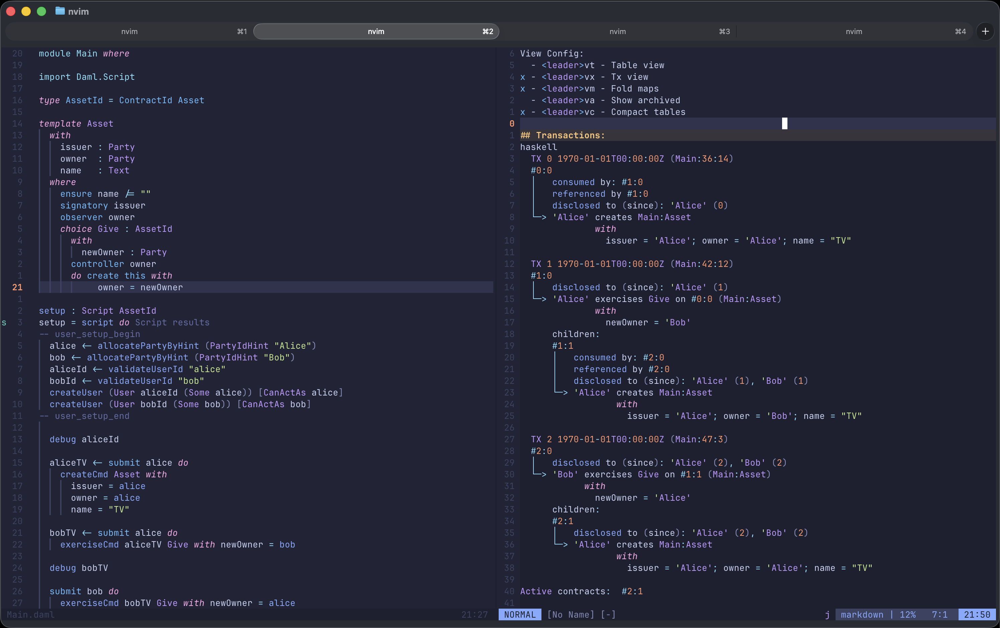

# daml.nvim



Full support for **DAML** (haskell-based smart contract language) in Neovim.

## Features

- **LSP**: Native support for diagnostics, formatting, code actions, and completion (auto-configures `blink.cmp`).
- **Script Results**: Run scripts (`<leader>gt`) and interact with transaction results (supports Table and Transaction views).
- **Syntax**: Maps `*.daml` to the **Haskell** Tree-sitter parser.
- **Lightweight**: Zero dependencies on `nvim-lspconfig`; uses Neovim 0.11+ native APIs.

## Requirements

- **Neovim 0.11+**
- **DPM/DAML** on `$PATH`

## Installation 

Lazy.nvim

```lua
{
  'Sengoku11/daml.nvim',
  ft = 'daml',
  dependencies = {
    'nvim-treesitter/nvim-treesitter',           -- syntax highlighting
    'saghen/blink.cmp',                          -- autocompletion
    'MeanderingProgrammer/render-markdown.nvim', -- pretty script results
  },
  keys = {
    { '<leader>gt', '<cmd>DamlRunScript<cr>', desc = 'Run Daml Script' },
  },
  opts = {
    -- cmd = { 'dpm', 'damlc', 'multi-ide' }, -- Uncomment if using DPM
  },
}
```

## Configuration

Default settings:

```lua
opts = {
  treesitter_map = true,           -- Map daml -> haskell TS parser
  keep_haskell_indent = true,      -- Use GetHaskellIndent() if available
  daml_script = { render = true }, -- Render script results as Markdown
  lsp = {
    enable = true,
    cmd = { 'daml', 'ide', '--RTS', '+RTS', '-M4G', '-N' }, -- You can pass some GHC flags too
    root_markers = { 'multi-package.yaml', 'daml.yaml', '.git' },
    capabilities = nil,            -- Nil = auto-detect blink.cmp
  },
  buffer_opts = {                  -- Standard editor config for DAML buffers
    expandtab = true,
    shiftwidth = 2,
    tabstop = 2,
    softtabstop = 2,
  },
}
```

## Keymaps

The plugin sets the following buffer-local keymaps for `daml` files:

| Mapping | Description |
| :--- | :--- |
| `]l` | Jump to next CodeLens (Script Result) |
| `[l` | Jump to previous CodeLens |
